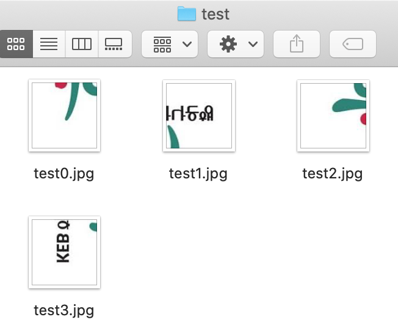

# Image-Cut-Paste
Use Pillow to cut an image to several pieces &amp;  paste pieces to make original image

## Requirements

* image file
* shell script with Pillow Library - pip install Pillow

## Features

- write 'cut_image.py ${image_file_name} ${column_number}  ${row_number} ${prefix_output_filename}' on shell script

  - cut column x row number of images with input
  - put random number between 0 to column x row number on each images
  - rotating, flipping, mirroring images randomly(50% chance for each action)
  - create folder name with prefix output filename
  - save cut images inside the folder

For example, it will create 4 images when you write 'cut_image_py hana.jpeg 2 2 test' in folder name 'test' with prefix name + random number

- paste_image.py ${folder_name} ${column_number}  ${row_number} ${output_filename} on shell script

  - choose images in folder
  - rotating, flipping, mirroring other images depends on selected first image
  - check pixel values of edges and find the smallest difference between images
  - paste images side by side depends on column and row number
  - create one image with 'output_filename' name (image might have been rotated, flipped, mirrored)
  
* original image

* new image

## Problem to solve

- cut_image.py can cut as many pieces as user wants but paste_image.py can only make a new image with 2x2 size
- if image has one color edges, it might not make a new image that user wants

